<div align="center">

# 🗺️ netbox-schematic

**A visual builder for racks, cable routes, power and IP space in [NetBox](https://netbox.dev).**

Sites, racks, devices, ports and cables on a single interactive 2D schematic —
watch a signal travel from a PC through patch panels to the core switch, and build
your infrastructure with clicks instead of forms and tables.


**English** · [Русский](README.ru.md)

</div>

---

The schematic is **never stored** — it is always computed from live NetBox data
(devices, cables, prefixes). No duplicate source of truth, no sync to drift.
The whole frontend is plain DOM + SVG + `fetch`: **no dependencies, no build step.**

## 🧭 Canvases

Switch canvases from the header (native picker on mobile).
*(The plugin UI is currently in Russian; canvas names are given here in English.)*

| Canvas | Status | What it does |
|---|---|---|
| **Infrastructure** | ✅ Ready | Racks, devices, ports, cables, power feeds. |
| **Networks / IPAM** | ✅ Ready | Address space: prefixes bound to places, occupied vs free IPs. |
| **Virtualization** | 🟡 Planned | Clusters, VMs, VM interfaces, a VLAN bus. |
| **Tunnels / VPN** | 🟡 Planned | Tunnels / L2VPN as an overlay over interfaces. |

## ✨ Current version — `0.67.0`

Everything below works today. The project is pre-1.0 and iterating quickly.

**Schematic & tracing**
- Devices as cards, ports as dots (patch-panel **front/rear** shown separately),
  cables as colour-coded non-crossing lines with round or angular (Manhattan) routing.
- **Path tracing** — click an occupied port and the whole signal path lights up
  end-to-end **through patch panels** (NetBox 4.6 `PortMapping` front↔rear aware).
- Layers, family filters, wireless links and provider circuits.

**Build mode** (toggle 👁 / ✏️ in the header)
- Create sites, locations, racks, devices (click a rack unit), cables (click two
  ports), prefixes and IP addresses — all written straight back to NetBox.
- A tree of **site group → site → location → rack** with drag-and-drop: move nodes
  between parents like folders, multi-select same-level items, rename and delete.
  NetBox also has *Regions*, but Region and Site Group are two **independent** grouping
  axes — neither nests inside the other — so putting both in one tree is ambiguous. The
  plugin uses **Site Group** for the organisational hierarchy (it nests: campus →
  office → branch); a site's Region, if set, is just a label, not a tree level.

**📱 Mobile & tablet** (a first-class mode, not a shrunk desktop)
- Sidebar becomes a drawer; details and rack views become bottom-sheets you can
  drag to dismiss; pinch-zoom and one-finger pan on the canvas.
- **Trace explorer** — tap a device to load *just* it, with fading "whiskers" on
  every connected port; tap a port to pull its neighbour in as a **full node** with
  real cables, and keep walking the topology hop by hop.
- **Swipe the tree** to work without a mouse: swipe → to multi-select (then
  **Move** by tapping a destination — "← here?"), swipe ← for a **create catalog**.

**Ready-made devices** — a one-click catalog (PC, switch, router, camera, PDU,
patch panel…) that provisions a `DeviceType` on demand. See below.

## 🛣️ Roadmap

About **two-thirds of the way to 1.0** — the shipped work is the interactive core;
what remains is mostly the "content" (two more canvases, network entities, platform).

```mermaid
flowchart LR
    subgraph shipped["✅ Shipped · v0.67 — ~2/3 to 1.0"]
        direction TB
        s1["Infrastructure canvas"]
        s2["Signal tracing through panels"]
        s3["Wire routing"]
        s4["Networks / IPAM"]
        s5["Hierarchy tree + move"]
        s6["Build mode + device catalog"]
        s7["Mobile: trace explorer + tree ops"]
        s8["Theme · docs"]
    end
    subgraph plan["🔜 Toward 1.0"]
        direction TB
        p1["Virtualization canvas"]
        p2["Tunnels / VPN canvas"]
        p3["Network entities: VLAN · IP Range · RIR · FHRP"]
        p4["Excel export / import"]
        p5["Device-model picker on create"]
        p6["i18n · hints · permissions"]
        p7["NetBox version range"]
    end
    shipped ==> plan
    classDef done fill:#132e1c,stroke:#2ea043,color:#c9f5d0;
    classDef todo fill:#21262d,stroke:#8b949e,color:#c9d1d9;
    class s1,s2,s3,s4,s5,s6,s7,s8 done
    class p1,p2,p3,p4,p5,p6,p7 todo
```



Priority order:

1. **Wire up network entities** — start with the **VLAN** axis (unblocks
   Virtualization / Tunnels / layers), then IP Range, Aggregate·RIR, Role, FHRP.
2. **Excel export / import** (backend `openpyxl` + parser) — following the target form.
3. **Device-model picker** — optionally pick a real vendor model on create (e.g. a
   *Canon* printer), on top of the quick ready-made catalog.
4. **Virtualization** canvas, then **Tunnels** (begin as an overlay on Infrastructure).
5. **Platform** — localisation, contextual hints, permission handling (403 → view-only).
6. **NetBox version compatibility** — target is 4.6 today; later detect the version
   and adapt, or declare a supported range.

## 📦 Installation

Requirements: **NetBox 4.6** (Django 6, Python 3.12) — the version this plugin is
developed and tested against. It uses current NetBox REST models (`Prefix.scope`,
the `vpn` app, the `PortMapping` front↔rear model), so older 4.x releases may differ.

```bash
pip install -e .          # from the repository root, inside the NetBox venv
```

In `configuration.py`:

```python
PLUGINS = ['netbox_schematic']
```

Restart NetBox — a **Plugins → Схематика** entry appears (`/plugins/schematic/`).
Authentication is the regular NetBox session; no tokens or CORS required.

## 🧰 Ready-made devices

Beyond adding devices from any existing NetBox device type, the plugin ships a
built-in catalog of **ready-made device solutions** — add them with one click from
the palette, the tree's "Add" menu, or (on mobile) the **+** button on the schema,
without choosing a device type. Each solution creates — on demand — a `DeviceType`
under a manufacturer named `Схематика` ("Schematic") with a role, an icon and default
port counts:

- **Consumers** — PC, laptop, printer, IP camera, TV, IP phone, CNC, POS, sensor.
- **Networking** — router, switch, access point, firewall, media converter, patch
  panel, provider (WAN).
- **Power** — PDU, UPS, voltage stabiliser, distribution panel. · **Racks.**

The catalog lives in `static/netbox_schematic/js/solutions.js` and is editable
without touching any logic (labels, icons, roles, colours, default port counts).

## 🔌 Device libraries from other repositories

The plugin renders **any** device already in NetBox — its built-in catalog is just a
convenience. To use real vendor models, import an external device-type library:

- **[netbox-community/devicetype-library](https://github.com/netbox-community/devicetype-library)**
  — a large community collection of `DeviceType` definitions (YAML) for real hardware.
- Import them one at a time via NetBox's device-type import, or in bulk with
  **[netbox-community/Device-Type-Library-Import](https://github.com/netbox-community/Device-Type-Library-Import)**.

Icons are chosen automatically from the device's role / name / model
(`iconForDevice()` in `solutions.js`), so imported devices get sensible icons.

## 🗂️ Repository layout

```text
netbox-schematic/
├── README.md                     — this file (EN)
├── README.ru.md                  — Russian version
├── LICENSE                       — Apache-2.0
├── pyproject.toml                — plugin package
└── netbox_schematic/             — NetBox plugin
    ├── __init__.py               — PluginConfig
    ├── navigation.py             — menu entry
    ├── views.py                  — view (LoginRequired)
    ├── urls.py
    ├── templates/netbox_schematic/
    │   └── schematic.html        — thin shell:  + 
    └── static/netbox_schematic/  — client-side logic (JS modules) and styles (CSS)
```

Tech: plain DOM + SVG + `fetch`, no dependencies and no build step. Authentication is
the NetBox session + CSRF (`X-CSRFToken` from a hidden form).

## 🛠️ Development

The plugin installs editable (`pip install -e .`); template edits are picked up by
the dev server immediately. After changing files in `static/`, run
`manage.py collectstatic` (or reload with caching disabled — with `DEBUG=True` the
dev server serves app static files directly). Geometry/layout changes are verified
with small Node harnesses on the real modules.

## 📄 License

Apache-2.0 — see [LICENSE](LICENSE).
