<div align="center">

# 🗺️ netbox-schematic

**Визуальный конструктор стоек, кабельных трасс, питания и адресного пространства для [NetBox](https://netbox.dev).**

Серверные, стойки, устройства, порты и кабели — на одной интерактивной 2D-схеме.
Смотри, как сигнал идёт от ПК через патч-панели до core-коммутатора, и строй
инфраструктуру **кликами**, а не формами и таблицами.


[English](README.md) · **Русский**

</div>

---

Схема **нигде не хранится** — всегда вычисляется из живых данных NetBox (устройства,
кабели, префиксы). Нет второго источника правды, нечему рассинхронизироваться.
Весь фронтенд — чистые DOM + SVG + `fetch`: **без зависимостей и без шага сборки.**

## 🧭 Холсты

Переключение — в шапке (на мобиле — нативный пикер).

| Холст | Статус | Что делает |
|---|---|---|
| **Инфраструктура** | ✅ Готов | Стойки, устройства, порты, кабели, питание. |
| **Сети / IPAM** | ✅ Готов | Адресное пространство: префиксы, привязанные к местам; занятые и свободные IP. |
| **Виртуализация** | 🟡 В планах | Кластеры, ВМ, VM-интерфейсы, VLAN-шина. |
| **Туннели / VPN** | 🟡 В планах | Туннели / L2VPN наложением поверх интерфейсов. |

## ✨ Текущая версия — `0.67.0`

Всё ниже работает уже сейчас. Проект до 1.0 и быстро развивается.

**Схема и трассировка**
- Устройства — карточками, порты — точками (**front/rear** патч-панелей раздельно),
  кабели — цветными линиями без пересечений, разводка круглая или угловая (Манхэттен).
- **Трассировка** — клик по занятому порту подсвечивает весь путь сигнала насквозь
  **через патч-панели** (с учётом модели `PortMapping` front↔rear в NetBox 4.6).
- Слои, фильтры по семействам, радио-линки и circuit-провайдеры.

**Режим стройки** (тумблер 👁 / ✏️ в шапке)
- Создание площадок, серверных, стоек, устройств (кликом по юниту), кабелей (кликом
  по двум портам), сетей и IP-адресов — всё пишется прямо в NetBox.
- Дерево **группа мест → площадка → серверная → стойка** с drag-and-drop: перенос
  узлов между родителями как папок, мультивыбор одного уровня, переименование, удаление.
  В NetBox есть ещё *регионы*, но регион и группа мест — две **независимые** оси (ни
  одна не вкладывается в другую), поэтому смешивать их в одном дереве неоднозначно.
  Плагин использует **группу мест** для орг-иерархии (она вложенная: кампус → офис →
  филиал); регион площадки, если задан, — просто метка, не уровень дерева.

**📱 Планшет и телефон** (полноценный режим, а не «ужатый десктоп»)
- Сайдбар — выезжающий drawer; детали и стойки — шторки снизу (закрываются свайпом);
  пинч-зум и панорамирование полотна одним пальцем.
- **Трасса-обозреватель** — тап по устройству грузит **только его** с тающими
  «волосками» на занятых портах; тап по порту подтягивает соседа **полной нодой** с
  реальными кабелями — и так шаг за шагом идёшь по топологии.
- **Работа с деревом без мыши**: кнопка «**Выбрать**» — мультивыбор одного уровня и
  **Переместить** (тап по месту → «← сюда?» → «Применить»); «**+**» на схеме открывает
  каталог создания устройств.

**Готовые устройства** — каталог в один клик (ПК, свич, роутер, камера, PDU,
патч-панель…), заводящий `DeviceType` по требованию. См. ниже.

## 🛣️ Роадмапа

Примерно **две трети пути к 1.0** — сделан интерактивный костяк; осталась в основном
«начинка» (ещё два холста, сетевые сущности, платформенное).

```mermaid
flowchart LR
    subgraph shipped["✅ Сделано · v0.67 — ~2/3 до 1.0"]
        direction TB
        s1["Холст «Инфраструктура»"]
        s2["Трассировка сквозь панели"]
        s3["Разводка проводов"]
        s4["Сети / IPAM"]
        s5["Дерево иерархии + перенос"]
        s6["Режим стройки + каталог устройств"]
        s7["Мобилка: трасса + работа с деревом"]
        s8["Тема · документация"]
    end
    subgraph plan["🔜 До 1.0"]
        direction TB
        p1["Холст «Виртуализация»"]
        p2["Холст «Туннели / VPN»"]
        p3["Сетевые сущности: VLAN · IP Range · RIR · FHRP"]
        p4["Excel: экспорт / импорт"]
        p5["Выбор модели при создании"]
        p6["Локализация · подсказки · права"]
        p7["Диапазон версий NetBox"]
    end
    shipped ==> plan
    classDef done fill:#132e1c,stroke:#2ea043,color:#c9f5d0;
    classDef todo fill:#21262d,stroke:#8b949e,color:#c9d1d9;
    class s1,s2,s3,s4,s5,s6,s7,s8 done
    class p1,p2,p3,p4,p5,p6,p7 todo
```



По приоритету:

1. **Сетевые сущности** — начать с оси **VLAN** (разблокирует Виртуализацию / Туннели /
   слои), затем IP Range, Aggregate·RIR, Role, FHRP.
2. **Excel-экспорт / импорт** (бэкенд `openpyxl` + парсер) — по образцу формы.
3. **Выбор модели устройства** — опционально указать реальную вендорскую модель при
   создании (напр. принтер *Canon*), поверх быстрого каталога готовых решений.
4. Холст **«Виртуализация»**, затем **«Туннели»** (начать наложением на Инфраструктуру).
5. **Платформенное** — локализация, подсказки, обработка прав (403 → только просмотр).
6. **Совместимость версий NetBox** — сейчас таргет 4.6; позже определять версию и
   адаптироваться либо объявить поддерживаемый диапазон.

## 📦 Установка

Требуется **NetBox 4.6** (Django 6, Python 3.12) — версия, под которую плагин
разрабатывается и тестируется. Используются актуальные модели REST (`Prefix.scope`,
приложение `vpn`, модель `PortMapping` front↔rear), поэтому на старых 4.x возможны
отличия.

```bash
pip install -e .          # из корня репозитория, внутри venv NetBox
```

В `configuration.py`:

```python
PLUGINS = ['netbox_schematic']
```

Перезапусти NetBox — в меню появится пункт **Plugins → Схематика**
(`/plugins/schematic/`). Аутентификация — обычная сессия NetBox; токены и CORS не нужны.

## 🧰 Готовые устройства

Кроме добавления устройств любого существующего типа NetBox, плагин везёт встроенный
каталог **готовых решений** — добавляй в один клик из палитры, меню «Добавить» в
дереве или (на мобиле) кнопкой «**+**» на схеме, не выбирая тип. Каждое решение по
требованию создаёт `DeviceType` под производителем **«Схематика»** с ролью, иконкой и
числом портов:

- **Потребители** — ПК, ноутбук, принтер, IP-камера, ТВ, IP-телефон, ЧПУ, POS, датчик.
- **Сетевое** — роутер, свич, точка доступа, файрвол, медиаконвертер, патч-панель,
  провайдер (WAN).
- **Питание** — PDU, ИБП, стабилизатор, распределительный щит. · **Стойки.**

Каталог — в `static/netbox_schematic/js/solutions.js`, правится без кода (подписи,
иконки, роли, цвета, число портов по умолчанию).

## 🔌 Библиотеки устройств из других репозиториев

Плагин рисует **любое** устройство, уже заведённое в NetBox — встроенный каталог лишь
для удобства. Для реальных вендорских моделей импортируй внешнюю библиотеку типов:

- **[netbox-community/devicetype-library](https://github.com/netbox-community/devicetype-library)**
  — большая коллекция определений `DeviceType` (YAML) под реальное железо.
- Импорт по одному через штатный импорт типов NetBox или массово —
  **[netbox-community/Device-Type-Library-Import](https://github.com/netbox-community/Device-Type-Library-Import)**.

Иконки подбираются автоматически по роли / имени / модели устройства
(`iconForDevice()` в `solutions.js`), так что импортированные устройства сразу с иконками.

## 🗂️ Структура репозитория

```text
netbox-schematic/
├── README.md                     — версия EN
├── README.ru.md                  — этот файл (RU)
├── LICENSE                       — Apache-2.0
├── pyproject.toml                — пакет плагина
└── netbox_schematic/             — плагин NetBox
    ├── __init__.py               — PluginConfig
    ├── navigation.py             — пункт меню
    ├── views.py                  — вью (LoginRequired)
    ├── urls.py
    ├── templates/netbox_schematic/
    │   └── schematic.html        — тонкая оболочка:  + 
    └── static/netbox_schematic/  — клиентская логика (JS-модули) и стили (CSS)
```

Технологии: чистые DOM + SVG + `fetch`, без зависимостей и без сборки. Аутентификация
— сессия NetBox + CSRF (`X-CSRFToken` из скрытой формы).

## 🛠️ Разработка

Плагин ставится editable (`pip install -e .`); правки шаблона подхватываются dev-сервером
сразу. После изменений в `static/` — `manage.py collectstatic` (или обновление с
отключённым кэшем — при `DEBUG=True` dev-сервер отдаёт статику плагина напрямую).
Геометрию/раскладку проверяем маленькими Node-харнессами на реальных модулях.

## 📄 Лицензия

Apache-2.0 — см. [LICENSE](LICENSE).
